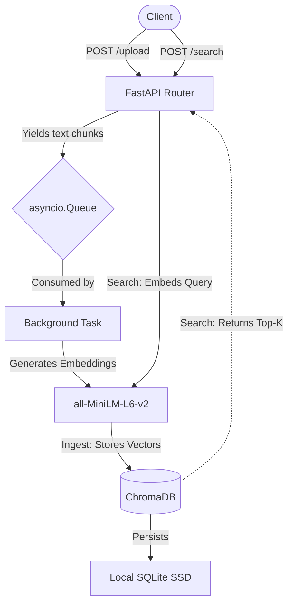

# Local RAG Ingestion Pipeline

A lightweight, memory-safe RAG (Retrieval-Augmented Generation) backend built to run locally without cloud dependencies.

I built this because I wanted a way to ingest and query large document sets on an 8GB M2 MacBook without running into Out-of-Memory (OOM) crashes or paying for cloud vector databases.

**Demo:** 


## Architecture & Core Tools



* **API Layer:** FastAPI (handles routing and graceful backpressure)
* **Concurrency:** Python `asyncio` (producer-consumer pattern via memory queues)
* **Embedding Engine:** `sentence-transformers` running locally
* **Vector Storage:** ChromaDB (bypassing network latency by writing directly to disk)

## Engineering Decisions

### 1. Bounded Queues for Memory Safety

Instead of loading entire files into RAM or dealing with the overhead of external message brokers like RabbitMQ, the pipeline uses a bounded `asyncio.Queue` (maxsize=50). This creates natural backpressure if the background worker is busy embedding text, the API gracefully pauses incoming requests, keeping memory consumption flat under load.

### 2. Lazy Evaluation Chunking

Traditional RAG setups read entire documents into memory before splitting them. I used Python generators (`yield`) to lazily stream text chunk-by-chunk. This means the server's memory footprint remains constant regardless of the file size.

### 3. Local Persistence over Network Calls

I bypassed RAM-only databases in favor of ChromaDB's `PersistentClient`. It flushes directly to an SQLite file on the SSD, providing fast semantic search without the overhead of maintaining a separate background database server.

## Project Structure

```text
├── app/
│   ├── main.py          # FastAPI application instance
│   ├── api/             # Route definitions (/upload, /search)
│   ├── core/            # Config and queue initialization
│   └── services/        # Chunking, embedding, and ChromaDB logic
├── data/                # Local SQLite persistence for Chroma
├── requirements.txt     # Pinned dependencies
└── README.md

```

## API Reference

| Method | Endpoint | Description |
| --- | --- | --- |
| `POST` | `/api/upload` | Streams a text file, chunks it lazily, and queues it for embedding. |
| `POST` | `/api/search` | Accepts a JSON query and returns the top-k most semantically relevant text chunks. |

## Quick Start

### Prerequisites

* Python 3.10+
* `uv` (Recommended) or `pip`

### 1. Setup the environment

```bash
git clone [https://github.com/leetingthecoding/rag-ingestion-pipeline.git](https://github.com/leetingthecoding/rag-ingestion-pipeline.git)
cd rag-ingestion-pipeline

# Create virtual environment and install exact dependencies
uv venv
uv pip install -r requirements.txt

```

### 2. Boot the server

```bash
uv run uvicorn app.main:app

```

The API will be live at `http://localhost:8000`. You can test the endpoints directly through the auto-generated Swagger UI at `http://localhost:8000/docs`.

